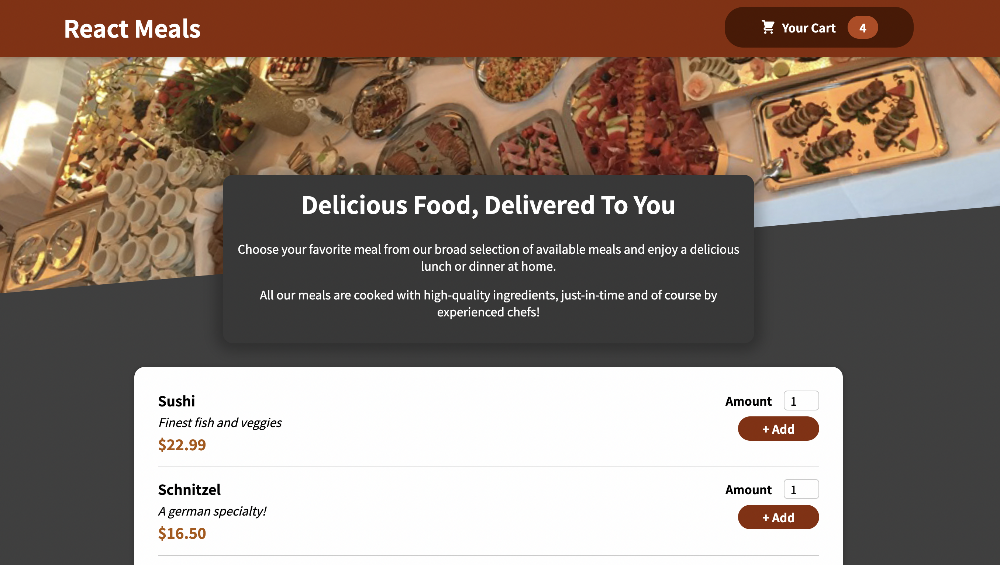

<h1 align="center">Welcome to React Meals 👋</h1>
<p>
  
  <a href="#" target="_blank">
    
  </a>
</p>

> A react app to practice core react concepts

### 🏠 [Homepage](https://github.com/GEOFARL/react-food-order-app)

### ✨ [Demo](https://geofarl.github.io/react-food-order-app/)

## Screenshots



## Install

```sh
npm install
```

## Usage

```sh
npm run start
```

## Run tests

```sh
npm run test
```

## Author

👤 **Maxim**

- Github: [@GEOFARL](https://github.com/GEOFARL)

## Show your support

Give a ⭐️ if this project helped you!
